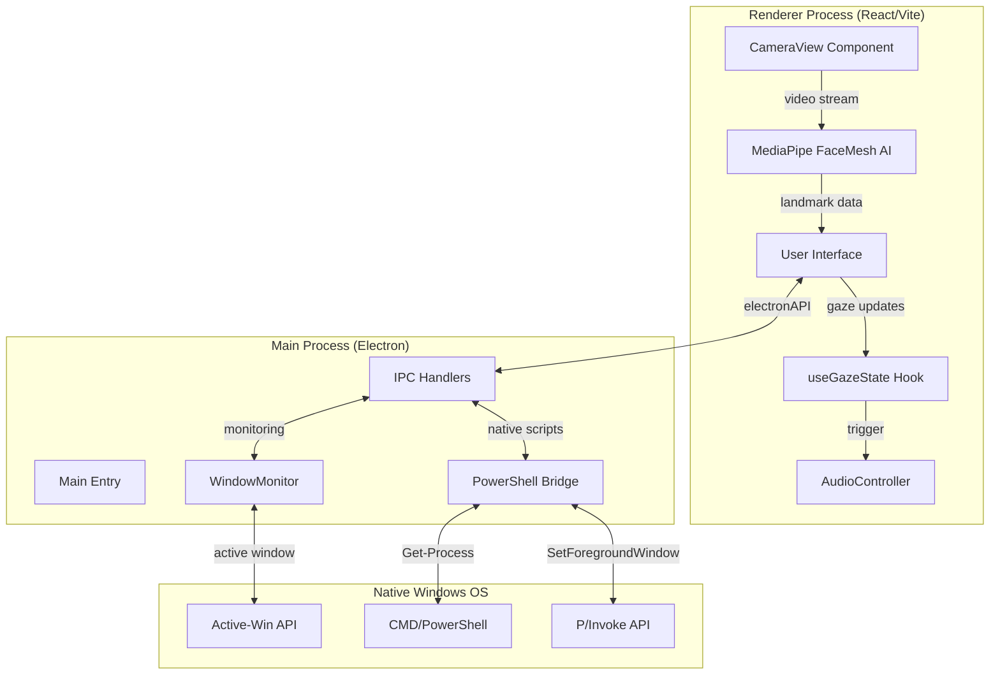
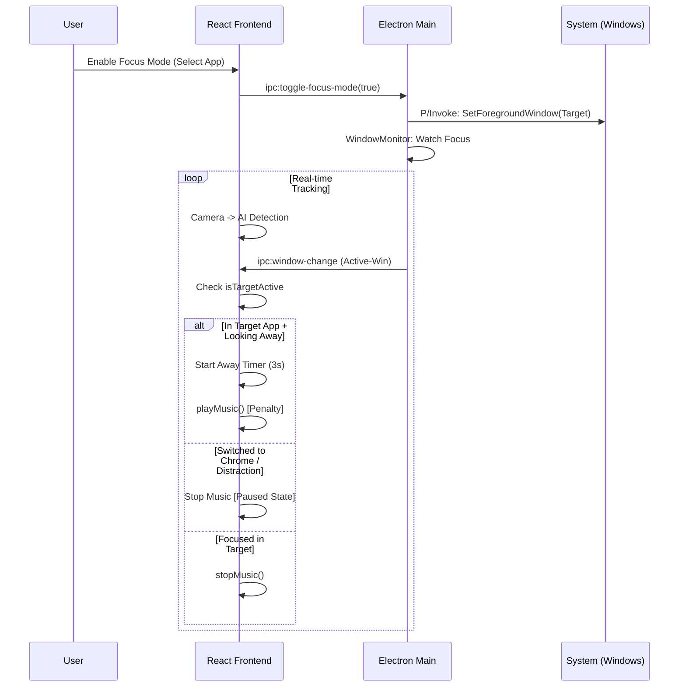

# Architecture Overview: Iris Focus Desktop

Iris Focus is built as a highly performant desktop assistant that combines real-time AI computer vision with native system integrations for professional productivity monitoring.

## 🏗️ High-Level Component Diagram

## 🔄 Focus Mode Flow

## 🧠 Key Logic Components

### Gaze Detection Algebra (`gazeMath.ts`)
The intelligence of Iris Focus lies in its normalized tracking logic:
- **Pitch/Yaw Validation**: Uses 3D landmark rotation.
- **Iris Offset**: Measures relative position of the iris within the eye boundaries.
- **EAR (Eye Aspect Ratio)**: Detects blinks vs. long-term eye closure.

### Precision Window Targeting
Unlike traditional web-based trackers, Iris Focus uses **Process IDs (PID)** to identify windows. This allows for 100% accurate detection even when multiple browser instances are running (e.g., distinguishing between a Brave "Work" window and a "Personal" window).

### Industrial Persistence
To prevent the OS from suspending the tracker when the app is "minimized", Iris Focus transforms its main window into a **1x1 transparent, always-on-top node**. This tricks the OS into maintaining full hardware priority for the camera and audio engines.
